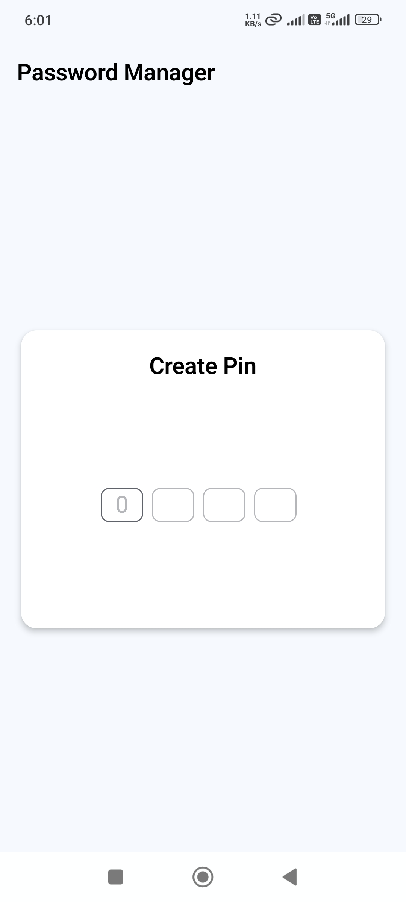

# Password Manager App


## Screenshots

<p align="center">
  
  
  
  
</p>

## Description

The **Password Manager App** is a secure and user-friendly mobile application that allows users to manage their passwords safely. The application follows a multi-layered security approach, using a custom 4-digit PIN to protect user access and AES encryption with SQLCipher for storing password data securely.

### Key Features

- **4-Digit PIN Login:**  
  On first launch, the user is required to create a 4-digit PIN to secure the app. This PIN is used for all subsequent logins.

- **Password Management:**  
  Once logged in, the user can create new password entries by clicking on the floating action button. Each password entry corresponds to an account (e.g., Gmail, Facebook, etc.).  
  - **Add:** Users can add a new password entry.  
  - **View:** The home screen displays a list of all saved password entries.  
  - **Edit/Delete:** Users can edit or delete existing password entries.

- **Password Strength Checker:**  
  As the user enters a new password, a password strength indicator is shown automatically.  
  - The strength checker activates only when the password has at least 8 characters.  
  - The password is evaluated based on the inclusion of upper-case letters, lower-case letters, digits, and special characters.  
  - The strength is displayed as "Weak", "Medium", or "Strong" with corresponding color indicators.

- **Secure Storage:**  
  The app uses SQLCipher with Room database to encrypt all stored data. In addition, AES encryption is used for individual password fields. Keys are securely stored using Android Keystore for extra security.


  ## Video Demo


https://github.com/user-attachments/assets/10b08212-fbdf-4244-b046-40188c9484f4


## How to Build, Run, and Use the Application

1. **Clone the Repository:**  
   ```bash
   git clone https://github.com/yourusername/password-manager-app.git
   cd password-manager-app
